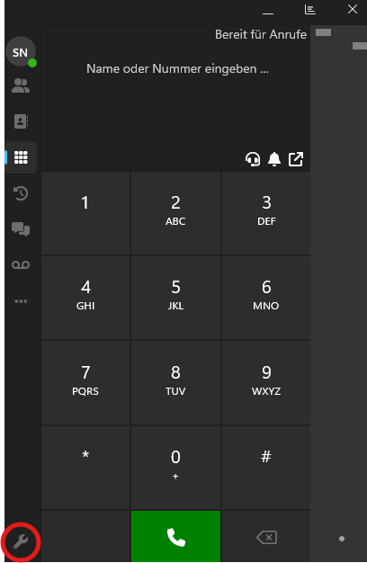
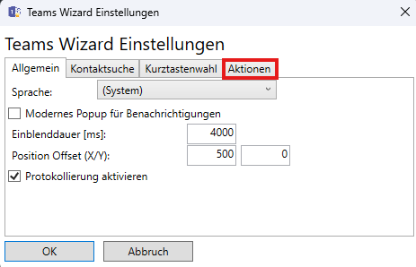
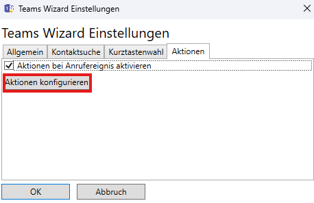
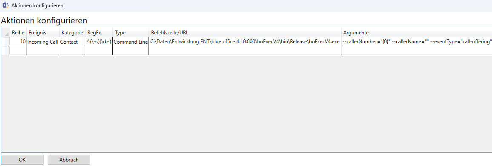

# **Einrichtung blueoffice-named-pipe**

Die *blueoffice-named-pipe* ist ein Thread, der gestartet werden kann, um externe Events ins **blue office** integrieren zu können. In dieser Dokumentation wird beschrieben, wie man den Server startet und welche Einrichtungsschritte in **3CX** sowie in **Teams** nötig sind, um eine provisorische Anrufserkennung einzurichten.

## **blueoffice-named-pipe Server starten**

Um den *blueoffice-named-pipe* Server zu starten, muss man in der Registry unter folgendem Pfad:

```
Computer\HKEY_CURRENT_USER\Software\blue office 4\Application\Settings\TAPI
```

das Feld `PipeLineActive` als `REG_SZ` erstellen (0 = Inaktiv, 1 = Aktiv).

---

## **Einrichtung 3CX**

**3CX** ermöglicht es mithilfe der CRM-Integration, ein 3CX-fremdes Programm aufzurufen. In unserem Fall rufen wir die `boV4Exec.exe` mit Parametern auf, die sich mit der *blueoffice-named-pipe* verbindet und basierend auf den gegebenen Parametern ein Event auslösen.

### **3CX Einstellungen**

**Schritt 1:** Markierten Punkt auswählen.



---

**Schritt 2:** Navigieren Sie zum Reiter **Integrationen** und aktivieren Sie den CRM-Tab über die Checkbox.


| Feld                  | Wert                                                                                    |
|-----------------------|-----------------------------------------------------------------------------------------|
| Anwendungspfad        | Hier muss die `boV4Exec.exe` ausgewählt werden.                                         |
| Zu sendende Parameter | `--callerNumber="%CallerNumber%" --callerName="%CallerName%" --eventType="call-offering"` |
| Benachrichtigen, wenn | Klingeln                                                                                |

---

## **TeamsWizard**

Der *TeamsWizard* ist eine Applikation, die es ermöglicht, Teams-Telefonanrufe zu erkennen und basierend darauf eine andere Applikation mit Parametern zu starten.

**Schritt 1:**  
[TeamsWizard herunterladen und installieren](https://www.lyncwizard.com/download/TeamsWizard_x64_v1.0.0a.zip)

**Schritt 2:**  
Navigieren Sie zu **„Aktionen konfigurieren“**.





---

**Schritt 3:**  
Beim *TeamsWizard* unter **Aktionen** folgende Aktion einrichten:

| Reihe | Ergebnis       | Kategorie | RegEx       | Typ          | Befehlszeile/URL            | Argumente                                                          |
|-------|----------------|-----------|-------------|--------------|-----------------------------|---------------------------------------------------------------------|
| 10    | Incoming Call  | Contact   | ^(\+.)?(\d+)| Command Line | (Pfad zur `boV4Exec.exe`)   | `--callerNumber="{0}" --callerName="" --eventType="call-offering"` |

---

**Schritt 4:**  
Die Einstellungen sollten danach wie folgt aussehen:


